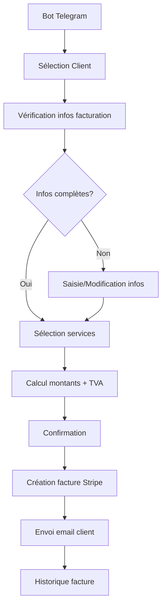

# 💳 Guide du Système de Facturation BerinIA

## 🎯 Vue d'ensemble

Le système de facturation BerinIA permet de gérer la facturation automatisée des clients via le bot Telegram avec intégration Stripe pour un processus professionnel.

## 🚀 Fonctionnalités

### ✨ Fonctionnalités principales
- **Gestion des informations de facturation** : Adresse, TVA, contact, etc.
- **Sélection de services** : Interface intuitive pour choisir les services à facturer
- **Intégration Stripe** : Création et envoi automatique de factures professionnelles
- **Interface Telegram** : Contrôle complet via le bot Telegram
- **Historique des factures** : Suivi complet des factures par client

### 🔧 Architecture technique
- **Backend API** : Endpoints FastAPI pour la gestion de facturation
- **Base de données** : Tables `leads` (enrichie), `invoices`, `services`
- **Stripe** : SDK Python pour la gestion des paiements
- **Bot Telegram** : Interface utilisateur intuitive

## 📋 Utilisation

### 1. 🤖 Via le Bot Telegram

1. **Accéder au menu facturation**
   - Ouvrir le bot Telegram BerinIA
   - Cliquer sur "💳 Facturer les clients"

2. **Sélectionner un client**
   - Choisir "👥 Sélectionner un client"
   - Naviguer dans la liste paginée des clients

3. **Gérer les informations de facturation**
   - Cliquer sur "📝 Modifier infos facturation"
   - Compléter/modifier : adresse, ville, pays, TVA, email, etc.

4. **Créer une facture**
   - Cliquer sur "🧾 Créer une facture"
   - Sélectionner les services à facturer
   - Confirmer les détails
   - Choisir : "✅ Créer et envoyer" ou "📝 Créer sans envoyer"

### 2. 🔧 Configuration Stripe

Éditez le fichier `/root/berinia/infra-ia/.env` et configurez vos clés Stripe :

```bash
# Configuration Stripe (REQUIS pour la facturation)
STRIPE_API_KEY=sk_test_51ABC123...votre_cle_stripe_ici
STRIPE_WEBHOOK_SECRET=whsec_1234...votre_secret_webhook_ici
```

**Où trouver vos clés :**
1. Connectez-vous à votre [Dashboard Stripe](https://dashboard.stripe.com)
2. **Clé API** : Développeurs → Clés API → Clé secrète
3. **Webhook Secret** : Développeurs → Webhooks → Créer un endpoint

### 3. 📊 Structure des données

#### Champs de facturation ajoutés au modèle Lead
```sql
billing_address      TEXT
billing_city         VARCHAR(255)
billing_postal_code  VARCHAR(20)
billing_country      VARCHAR(100)
vat_number          VARCHAR(50)
billing_email       VARCHAR(255)
billing_contact_name VARCHAR(255)
stripe_customer_id   VARCHAR(255)
```

#### Table invoices
```sql
id                    INTEGER PRIMARY KEY
lead_id              INTEGER REFERENCES leads(id)
invoice_number       VARCHAR(50) UNIQUE
stripe_invoice_id    VARCHAR(255)
amount               FLOAT
tax_amount           FLOAT
total_amount         FLOAT
currency             VARCHAR(3) DEFAULT 'EUR'
status               VARCHAR(20) DEFAULT 'draft'
invoice_date         TIMESTAMP
services_data        JSON
billing_data         JSON
```

## 🔌 API Endpoints

### Gestion des informations de facturation
- `GET /billing/lead/{lead_id}` - Récupérer infos facturation
- `PUT /billing/lead/{lead_id}` - Mettre à jour infos facturation

### Gestion des factures
- `POST /billing/create-invoice` - Créer une facture
- `GET /billing/invoices/{lead_id}` - Factures d'un client
- `GET /billing/invoice/{invoice_id}` - Détails d'une facture
- `POST /billing/invoice/{invoice_id}/send` - Envoyer par email

### Services
- `GET /conversions/services/` - Liste des services disponibles

## 🎛️ Workflow complet



## 🛠️ Installation et Tests

### Installation des dépendances
```bash
cd /root/berinia/backend
source venv/bin/activate
pip install stripe>=5.0.0
```

### Application des migrations
```bash
alembic upgrade head
```

### Test du système
```bash
# Test complet du système de facturation
python test_billing_system.py

# Test spécifique de la configuration Stripe
python test_stripe_config.py
```

## 🎯 Exemples d'utilisation

### 1. Création de facture via API
```python
import requests

invoice_data = {
    "lead_id": 1,
    "services": [
        {"service_id": 1, "quantity": 1},
        {"service_id": 2, "quantity": 1}
    ],
    "send_email": True
}

response = requests.post(
    "http://localhost:8000/billing/create-invoice",
    json=invoice_data
)
```

### 2. Utilisation du service Stripe
```python
from app.services.stripe_service import StripeService

stripe_service = StripeService()
customer = stripe_service.create_or_update_customer(
    email="client@example.com",
    name="Client Example",
    address={
        'line1': '123 Rue Example',
        'city': 'Paris',
        'postal_code': '75001',
        'country': 'FR'
    }
)
```

## 🚨 Points d'attention

### Sécurité
- ⚠️ **Ne jamais** exposer les clés Stripe en public
- ✅ Utiliser des variables d'environnement
- ✅ Valider toutes les entrées utilisateur
- ✅ Logs des actions de facturation

### Conformité
- 📋 Respecter les réglementations de facturation françaises
- 🧾 Numérotation séquentielle des factures
- 📊 Gestion correcte de la TVA
- 📧 Archivage des factures

### Performance
- 🔄 Pagination des listes de clients
- 💾 Cache des données fréquemment accédées
- 📊 Indexation des champs de recherche

## 🎉 Prochaines améliorations

1. **Gestion des devis** avant facturation
2. **Facturation récurrente** pour les abonnements
3. **Rapports financiers** avancés
4. **Intégration comptable** (export)
5. **Notifications automatiques** de relance
6. **Multi-devises** pour clients internationaux

## 📞 Support

En cas de problème :
1. Vérifier les logs : `journalctl -u berinia-api.service -f`
2. Tester la connectivité : `python test_billing_system.py`
3. Vérifier la configuration Stripe
4. Consulter la documentation Stripe API

---

🎯 **Le système de facturation BerinIA est maintenant opérationnel et prêt à être utilisé !**