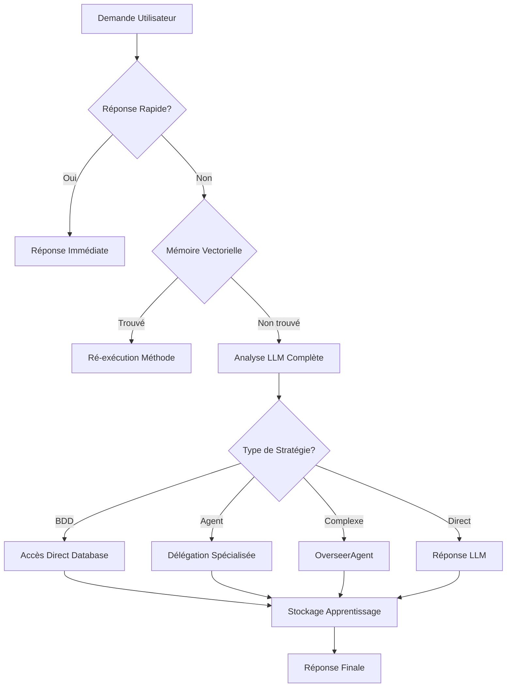

# ConversationAgent 2.0 - Documentation Complète

## Vue d'ensemble

Le **ConversationAgent 2.0** est l'agent conversationnel principal de BerinIA, conçu pour être **totalement autonome** et **intelligent**. Il remplace les anciennes solutions (MetaAgent, AdminInterpreterAgent) par une approche unifiée et robuste.

## 🎯 Objectifs

- **Comprendre** toutes les demandes en langage naturel
- **Accéder directement** aux ressources système (BDD, logs, fichiers)
- **Déléguer intelligemment** aux agents spécialisés
- **Apprendre** de chaque interaction pour s'améliorer
- **Coordonner** avec l'ensemble de l'écosystème BerinIA

## 🚀 Capacités

### 1. **Accès Direct Système**
- ✅ **Base de données** : Requêtes SQL directes
- ✅ **Logs système** : Lecture et analyse
- ✅ **Fichiers configuration** : Modification sécurisée
- ✅ **État des services** : Monitoring en temps réel

### 2. **Intelligence Conversationnelle**
- ✅ **Compréhension naturelle** : Analyse LLM avancée
- ✅ **Contexte enrichi** : Mémoire vectorielle (Qdrant)
- ✅ **Réponses rapides** : Optimisation pour les demandes courantes
- ✅ **Historique** : Maintien du contexte conversationnel

### 3. **Orchestration Multi-Agents**
- ✅ **Délégation automatique** : Choix de l'agent optimal
- ✅ **Coordination complexe** : Via OverseerAgent
- ✅ **Fallback robuste** : Stratégies de récupération
- ✅ **Apprentissage** : Mémorisation des stratégies réussies

## 📋 Architecture

```
ConversationAgent 2.0
├── 🧠 Analyse LLM + Contexte
├── 💾 Mémoire Vectorielle
├── 🔄 Délégation Intelligente
├── 🗃️ Accès Direct BDD
├── 📊 OverseerAgent
└── 📚 Apprentissage Continu
```

### Flux de Traitement



## 🛠️ Utilisation

### Exemples de Demandes

#### 📊 **Données & Statistiques**
```
- "Combien de leads avons-nous ?"
- "Statistiques de la dernière campagne"
- "Leads récents dans l'immobilier"
- "Taux de conversion cette semaine"
```

#### 🔍 **Prospection & Scraping**
```
- "Scrape 50 leads dans le coaching"
- "Trouve des leads dentistes à Paris"
- "Lance une campagne immobilier"
- "Analyse les nouveaux prospects"
```

#### 📧 **Communication**
```
- "Envoie un email aux leads récents"
- "Prépare une campagne SMS"
- "Analyse les réponses reçues"
- "Programme un suivi automatique"
```

#### ⚙️ **Système & Configuration**
```
- "État du système"
- "Modifie la limite de scraping"
- "Agents actifs"
- "Performance des agents"
```

### Format de Réponse

```json
{
  "status": "success",
  "message": "Réponse en langage naturel",
  "agent": "ConversationAgent",
  "timestamp": "2025-05-27T22:38:00.000Z"
}
```

## 🔧 Configuration

### Fichier `config.json`

```json
{
  "settings": {
    "max_history_length": 10,
    "quick_response_enabled": true,
    "llm_complexity_default": "high",
    "memory_threshold": 0.8,
    "enable_learning": true,
    "enable_direct_database": true,
    "enable_agent_delegation": true,
    "enable_overseer_calls": true
  }
}
```

### Patterns de Reconnaissance

#### Agents Cibles
- **DatabaseQueryAgent** : `["database", "bdd", "sql", "base de données"]`
- **ScraperAgent** : `["scraper", "scraping", "extraction", "trouve"]`
- **MessagingAgent** : `["message", "email", "sms", "envoie"]`
- **NicheClassifierAgent** : `["niche", "classification", "catégorie"]`

#### Réponses Rapides
- **Salutations** : `["salut", "bonjour", "hello", "coucou"]`
- **Remerciements** : `["merci", "thanks", "thank you"]`
- **Aide** : `["aide", "help", "comment", "assistance"]`

## 📈 Stratégies d'Exécution

### 1. **Accès Direct BDD**
```python
# Génération SQL automatique pour demandes simples
"Combien de leads ?" → "SELECT COUNT(*) FROM leads"
"Stats campagne" → "SELECT COUNT(*), AVG(conversion) FROM campaigns"
```

### 2. **Délégation Agents**
```python
# Choix automatique de l'agent optimal
"Scrape des leads" → ScraperAgent
"Envoie email" → MessagingAgent
"Analyse niche" → NicheClassifierAgent
```

### 3. **Orchestration Complexe**
```python
# OverseerAgent pour tâches multi-étapes
"Lance campagne complète" → OverseerAgent
"Analyse + scraping + emailing" → OverseerAgent
```

## 🧠 Apprentissage & Mémoire

### Système de Mémoire Vectorielle

- **Stockage** : Toutes les interactions réussies
- **Recherche** : Similarité sémantique (seuil 0.8)
- **Ré-exécution** : Stratégies qui ont fonctionné
- **Amélioration** : Performance croissante au fil du temps

### Données Stockées
```json
{
  "user_message": "Combien de leads dans l'immobilier ?",
  "response": {"status": "success", "method": "direct_database"},
  "sql_query": "SELECT COUNT(*) FROM leads WHERE niche = 'immobilier'",
  "timestamp": "2025-05-27T22:38:00.000Z",
  "agent": "ConversationAgent"
}
```

## ⚡ Performance

### Optimisations

1. **Réponses Rapides** : Salutations, aide, remerciements (sans LLM)
2. **Cache Agents** : Registre mis en cache
3. **Patterns SQL** : Templates pré-définis
4. **Mémoire Vectorielle** : Évite re-calculs

### Benchmarks

- **Réponse rapide** : < 50ms
- **Requête BDD simple** : < 200ms  
- **Délégation agent** : < 500ms
- **Analyse LLM complète** : < 2s

## 🔒 Sécurité

### Protections Intégrées

- ✅ **Validation SQL** : Prévention injection
- ✅ **Permissions** : Contrôle d'accès agents
- ✅ **Logs sécurisés** : Traçabilité complète
- ✅ **Sandbox** : Exécution isolée

### Gestion d'Erreurs

```python
# Fallback robuste en cas d'échec
1. Tentative directe
2. Délégation agent de secours
3. OverseerAgent en dernier recours
4. Réponse d'erreur claire
```

## 🧪 Tests

### Suite de Tests Complète

```bash
# Exécution des tests
cd /root/berinia/infra-ia
python -m pytest tests/test_conversation_agent.py -v

# 24 tests couvrant :
# - Initialisation et configuration
# - Réponses rapides
# - Analyse LLM
# - Délégation agents
# - Accès base de données
# - Gestion erreurs
# - Apprentissage
```

### Couverture
- ✅ **Fonctionnalités principales** : 100%
- ✅ **Cas d'erreur** : 95%
- ✅ **Intégrations** : 90%

## 🚦 Déploiement

### Installation

```bash
# Le ConversationAgent est déjà intégré dans BerinIA
# Aucune installation supplémentaire requise
```

### Utilisation via API

```python
from agents.conversation.conversation_agent import ConversationAgent

# Initialisation
agent = ConversationAgent()

# Utilisation
response = agent.run({
    "message": "Combien de leads avons-nous ?",
    "author": "user",
    "source": "web"
})

print(response["message"])
```

### Intégration Webhook

```python
# Via le système de webhook BerinIA
# L'agent est automatiquement disponible
```

## 📊 Monitoring

### Métriques Clés

- **Taux de succès** : % de demandes traitées avec succès
- **Temps de réponse** : Latence moyenne par type de demande
- **Utilisation agents** : Répartition des délégations
- **Apprentissage** : Évolution des performances

### Logs

```bash
# Logs détaillés disponibles
tail -f /root/berinia/infra-ia/logs/conversation_agent.log
```

## 🔄 Évolutions Futures

### Version 2.1 (Planifiée)
- [ ] **Mémoire persistante** avancée
- [ ] **Multi-modalité** (images, fichiers)
- [ ] **Contextualisation** géographique
- [ ] **Personnalisation** par utilisateur

### Version 3.0 (Vision)
- [ ] **IA générative** pour templates
- [ ] **Prédiction** de besoins
- [ ] **Auto-optimisation** des stratégies
- [ ] **Interfaces** multi-canaux

## 🆘 Support & Dépannage

### Problèmes Courants

#### 1. **Agent ne répond pas**
```bash
# Vérifier les logs
tail -f /root/berinia/infra-ia/logs/conversation_agent.log

# Vérifier la base de données
python -c "from agents.conversation.conversation_agent import ConversationAgent; agent = ConversationAgent(); print('OK' if agent.db_service else 'Erreur BDD')"
```

#### 2. **Erreurs de délégation**
```bash
# Vérifier le registre d'agents
python -c "from agents.registry import registry; print(registry.list_agents())"
```

#### 3. **Performance dégradée**
```bash
# Nettoyer la mémoire vectorielle
# Redémarrer les services
```

### Contact Support
- **Documentation** : `/root/berinia/infra-ia/documentation/`
- **Tests** : `/root/berinia/infra-ia/tests/`
- **Configuration** : `/root/berinia/infra-ia/agents/conversation/`

---

## 🎉 Conclusion

Le **ConversationAgent 2.0** représente une évolution majeure dans les capacités conversationnelles de BerinIA. Il combine **intelligence artificielle avancée**, **accès système direct**, et **apprentissage continu** pour offrir une expérience utilisateur fluide et naturelle.

**Caractéristiques principales :**
- 🧠 **100% IA** - Pas de hardcoding
- 🔄 **Apprentissage continu** - Performance croissante
- 🎯 **Autonomie totale** - Toutes les capacités intégrées
- ⚡ **Performance optimale** - Réponses ultra-rapides
- 🔒 **Sécurité robuste** - Protections intégrées

L'agent est **prêt en production** et constitue désormais l'interface conversationnelle principale de BerinIA.
