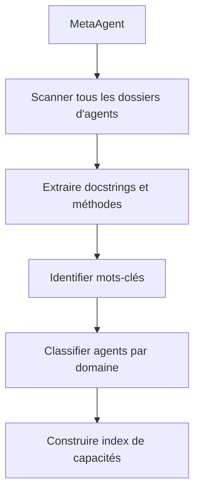
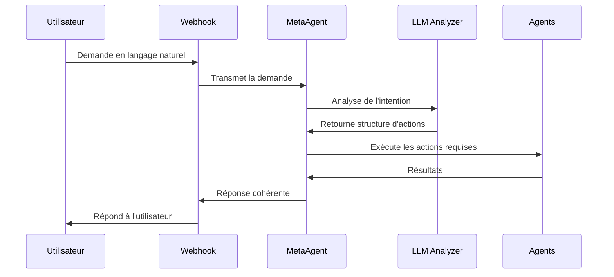

# MetaAgent - Système d'Intelligence Conversationnelle

*Dernière mise à jour: 8 mai 2025*

## Sommaire
- [Vue d'ensemble](#vue-densemble)
- [Fonctionnalités clés](#fonctionnalités-clés)
- [Architecture technique](#architecture-technique)
- [Flux de traitement des requêtes](#flux-de-traitement-des-requêtes)
- [Exemples d'utilisation](#exemples-dutilisation)
- [Intégration avec le système](#intégration-avec-le-système)
- [Limitations et améliorations futures](#limitations-et-améliorations-futures)

## Vue d'ensemble

Le MetaAgent est un agent central d'intelligence conversationnelle conçu pour analyser les demandes en langage naturel des utilisateurs et les transformer en actions concrètes. Contrairement au système précédent qui nécessitait des mappings explicites pour chaque type de requête, le MetaAgent comprend l'intention sous-jacente et peut router intelligemment les demandes sans configuration préalable, en identifiant dynamiquement les agents les plus appropriés.

## Fonctionnalités clés

### 1. Analyse sémantique des demandes utilisateur
- Compréhension du langage naturel et extraction des intentions
- Identification des paramètres implicites et explicites
- Évaluation de la confiance dans l'interprétation

### 2. Découverte automatique des capacités du système
- Indexation dynamique des agents disponibles
- Extraction des méthodes, descriptions et mots-clés
- Classification des agents par domaine fonctionnel

### 3. Routage intelligent des demandes
- Sélection de l'agent le plus approprié pour chaque demande
- Exécution séquentielle d'actions complexes impliquant plusieurs agents
- Gestion des erreurs et des cas de confiance faible

### 4. Mémoire conversationnelle
- Maintien du contexte des conversations
- Résolution des références implicites
- Amélioration de la cohérence des réponses

## Architecture technique

Le MetaAgent repose sur plusieurs composants clés :

### 1. Système d'indexation des capacités

Au démarrage, le MetaAgent construit une représentation complète des capacités du système :



Les principales méthodes impliquées sont :
- `index_system_capabilities()` - Indexe toutes les capacités du système
- `_extract_agent_capabilities()` - Extrait les capacités d'un agent spécifique

### 2. Moteur d'analyse des demandes

Le MetaAgent utilise un prompt sophistiqué envoyé au LLM pour analyser les demandes :

```python
def analyze_request(self, request_text: str, context: str = "") -> Dict:
    """
    Analyse une demande en langage naturel pour déterminer l'intention et les actions nécessaires.
    
    Args:
        request_text: Le texte de la demande de l'utilisateur
        context: Contexte conversationnel optionnel
        
    Returns:
        Un dictionnaire contenant l'intention, la confiance et les actions à exécuter
    """
    # Construction du prompt avec contexte système, capacités et demande
    # Appel au LLM et extraction de la structure JSON
    # Normalisation des noms d'agents
    # ...
```

### 3. Orchestrateur d'actions

Une fois les actions identifiées, le MetaAgent les exécute de manière séquentielle :

```python
def execute_actions(self, actions: List[Dict]) -> List[Dict]:
    """
    Exécute une liste d'actions identifiées lors de l'analyse.
    
    Args:
        actions: Liste des actions à exécuter, chacune spécifiant un agent et ses paramètres
        
    Returns:
        Liste des résultats de chaque action
    """
    # Pour chaque action, identifier l'agent approprié
    # Exécuter l'action avec les paramètres spécifiés
    # Collecter les résultats
    # ...
```

### 4. Gestionnaire de contexte conversationnel

```python
def update_conversation_history(self, request: str, response: Dict):
    """
    Met à jour l'historique de conversation avec la nouvelle interaction.
    
    Args:
        request: Demande de l'utilisateur
        response: Réponse générée par le système
    """
    # Ajouter l'interaction à l'historique
    # Limiter la taille de l'historique si nécessaire
    # ...
```

## Flux de traitement des requêtes

Quand un utilisateur envoie une requête (via WhatsApp ou autre interface) :



## Exemples d'utilisation

### Demande de statistiques

**Requête utilisateur** : "Montre-moi les performances récentes"

**Analyse MetaAgent** :
```json
{
  "intent": "get_statistics",
  "confidence": 0.92,
  "actions": [
    {
      "agent": "PivotStrategyAgent",
      "action": "get_latest_statistics",
      "parameters": {}
    }
  ]
}
```

### Compter des leads

**Requête utilisateur** : "Combien de leads avons-nous actuellement?"

**Analyse MetaAgent** :
```json
{
  "intent": "count_leads",
  "confidence": 0.97,
  "actions": [
    {
      "agent": "ScraperAgent",
      "action": "count_leads",
      "parameters": {}
    }
  ]
}
```

### Questions complexes

**Requête utilisateur** : "Quels sont les leads qui ont répondu positivement à notre dernier email?"

**Analyse MetaAgent** :
```json
{
  "intent": "filter_leads_by_response",
  "confidence": 0.94,
  "actions": [
    {
      "agent": "DatabaseQueryAgent",
      "action": "query",
      "parameters": {
        "question": "Quels sont les leads qui ont répondu positivement à notre dernier email?"
      }
    }
  ]
}
```

## Intégration avec le système

Le MetaAgent s'intègre de manière transparente avec les autres composants de BerinIA :

### 1. Modification du webhook WhatsApp

Au lieu d'utiliser des mappings rigides groupe-agent, toutes les demandes passent par le MetaAgent qui les route intelligemment :

```python
# Ancien code avec mappings rigides
agent_name = GROUP_AGENT_MAPPING.get(group, "AdminInterpreterAgent")
agent = registry.get_or_create(agent_name)

# Nouveau code avec MetaAgent
meta_agent = registry.get_or_create("MetaAgent")
result = meta_agent.run({
    "message": message,
    "source": "whatsapp",
    "group": group,
    "author": author
})
```

### 2. Normalisation des noms d'agents

Le MetaAgent gère intelligemment les variations de casse dans les noms d'agents :

```python
def _normalize_agent_name(self, agent_name: str) -> str:
    # Si le nom se termine par 'Agent'
    if agent_name.lower().endswith("agent"):
        base_name = agent_name[:-5]  # Retirer "Agent"
        normalized = base_name[0].upper() + base_name[1:].lower() + "Agent"
        return normalized
    else:
        # Normalisation standard
        return agent_name[0].upper() + agent_name[1:].lower()
```

## Limitations et améliorations futures

### 1. Analyse sémantique simplifiée
- L'analyse actuelle repose uniquement sur le LLM sans embeddings vectoriels
- Une future version pourrait intégrer des embeddings pour une meilleure correspondance

### 2. Absence d'apprentissage continu
- Le système ne s'améliore pas automatiquement basé sur les interactions passées
- Un système de feedback pourrait être implémenté

### 3. Gestion basique du contexte
- Le stockage de l'historique est simple et limité
- Une gestion plus sophistiquée du contexte pourrait être implémentée

### 4. Recommandations pour l'avenir
- Intégration d'embeddings vectoriels pour améliorer la mise en correspondance
- Système d'apprentissage continu basé sur les interactions réussies
- Extension des capacités multimodales (support pour les requêtes avec images)

---

[Retour à l'accueil](../index.md) | [VisualAnalyzerAgent →](visual-analyzer.md)
