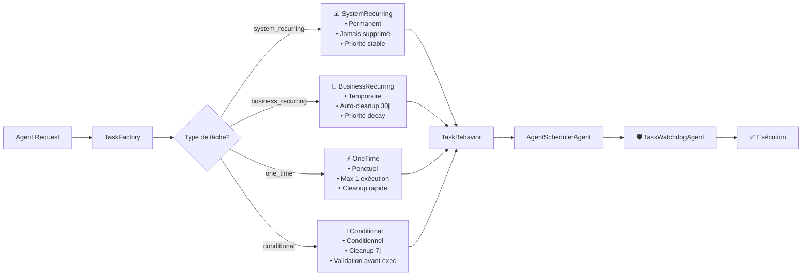

# 🚀 Architecture Avancée des Types de Tâches - Phase 2

## 📋 Vue d'ensemble

La **Phase 2** de l'AgentSchedulerAgent introduit une architecture avancée avec **4 types de tâches** offrant un contrôle granulaire du cycle de vie, un système de turnover automatique et une API générique pour les agents.

### 🎯 Objectifs Phase 2

- ✅ **4 types de comportements** : system_recurring, business_recurring, one_time, conditional
- ✅ **Turnover automatique** : Nettoyage intelligent selon le type
- ✅ **Factory Pattern** : Création simple et cohérente
- ✅ **API générique** : Interface unifiée pour tous les agents
- ✅ **Compatibilité rétroactive** : Ancien système toujours fonctionnel

---

## 🏗️ Architecture des 4 Types de Tâches

### 📊 Vue d'ensemble des Types



---

## 🎭 Types de Tâches Détaillés

### 📊 **system_recurring** - Tâches Système Permanentes

**Usage :** Tâches critiques du système qui ne doivent jamais être supprimées.

```python
# Création via Factory
behavior = TaskFactory.create_system_recurring()

# Caractéristiques
{
    "task_type": "system_recurring",
    "auto_cleanup": False,          # Jamais de nettoyage automatique
    "cleanup_after_days": None,     # Pas de limite de temps
    "priority_decay": False,        # Priorité toujours stable
    "max_executions": None          # Exécutions illimitées
}
```

**Exemples d'usage :**
- Monitoring système quotidien
- Backups automatiques
- Vérifications de santé du système
- Supervision de sécurité

**API simplifiée :**
```python
scheduler.run({
    "action": "schedule_advanced_task",
    "task_type": "system_recurring",
    "task_data": {
        "agent": "ProspectionSupervisor",
        "action": "daily_monitoring"
    },
    "execution_time": "2025-05-31T09:00:00",
    "recurrence_interval": 86400  # 24h
})
```

### 💼 **business_recurring** - Tâches Business Temporaires

**Usage :** Tâches business avec fin de vie automatique et décroissance de priorité.

```python
# Création avec paramètres spécifiques
behavior = TaskFactory.create_business_recurring(
    cleanup_after_days=60,    # Nettoyage après 60 jours
    end_date=1735689600,      # Fin le 31/12/2025
    priority_decay=True       # Baisse de priorité dans le temps
)
```

**Caractéristiques intelligentes :**
- **Auto-cleanup** : Suppression automatique selon l'âge
- **End_date** : Date de fin explicite possible
- **Priority decay** : +1 priorité par jour après 7 jours d'âge
- **Nettoyage adaptatif** : 30 jours par défaut

**Exemples d'usage :**
- Campagnes marketing temporaires
- Projets avec deadline
- Prospection intensive limitée dans le temps
- Actions saisonnières

```python
scheduler.run({
    "action": "schedule_advanced_task",
    "task_type": "business_recurring",
    "task_data": {
        "agent": "CampaignAgent",
        "action": "run_holiday_campaign"
    },
    "execution_time": "2025-05-31T10:00:00",
    "recurrence_interval": 604800,  # 1 semaine
    "end_date": "2025-12-31T23:59:59",
    "cleanup_after_days": 45
})
```

### ⚡ **one_time** - Tâches Ponctuelles

**Usage :** Exécution unique puis suppression immédiate.

```python
behavior = TaskFactory.create_one_time()

# Comportement strict
{
    "max_executions": 1,           # Une seule exécution
    "auto_cleanup": True,          # Toujours nettoyer
    "cleanup_after_days": 1,       # Suppression rapide
    "recurring": False             # Jamais de récurrence
}
```

**Exemples d'usage :**
- Emails urgents immédiats
- Notifications ponctuelles
- Actions de correction uniques
- Déclenchements événementiels

```python
scheduler.run({
    "action": "schedule_advanced_task",
    "task_type": "one_time",
    "task_data": {
        "agent": "MessagingAgent",
        "action": "send_urgent_notification",
        "params": {
            "recipient": "admin@berinia.com",
            "subject": "Alerte Système"
        }
    },
    "execution_time": "2025-05-31T15:30:00"
})
```

### 🎯 **conditional** - Tâches Conditionnelles

**Usage :** Exécution seulement si condition remplie.

```python
behavior = TaskFactory.create_conditional(
    condition="no_response_after_48h",
    cleanup_after_days=7,
    auto_cleanup=True
)
```

**Logique conditionnelle :**
```python
def _check_condition(self) -> bool:
    if not self.condition:
        return True  # Pas de condition = autorisé
    
    # Condition False explicite = refusé
    if self.condition == False:
        return False
    
    # Ici on peut implémenter une logique plus complexe
    # Ex: vérifier une base de données, un état externe, etc.
    return True
```

**Exemples d'usage :**
- Follow-up automatique selon réponse
- Actions de relance conditionnelles
- Déclenchements selon métriques
- Workflows adaptatifs

```python
scheduler.run({
    "action": "schedule_advanced_task",
    "task_type": "conditional",
    "task_data": {
        "agent": "FollowUpAgent",
        "action": "send_reminder",
        "params": {"lead_id": "L123"}
    },
    "execution_time": "2025-06-02T10:00:00",
    "condition": "no_response_after_48h",
    "cleanup_after_days": 7
})
```

---

## 🏭 Factory Pattern et API

### 🔧 TaskFactory - Création Simplifiée

```python
from agents.scheduler.task_types import TaskFactory, TaskType

# Méthodes statiques pour chaque type
system_task = TaskFactory.create_system_recurring()
business_task = TaskFactory.create_business_recurring(cleanup_after_days=30)
onetime_task = TaskFactory.create_one_time()
conditional_task = TaskFactory.create_conditional(condition="custom_logic")

# Factory générique depuis requête agent
behavior = TaskFactory.create_from_agent_request({
    "task_type": "business_recurring",
    "cleanup_after_days": 60,
    "end_date": "2025-12-31T23:59:59"
})
```

### 📡 API Générique Unifiée

#### **Endpoint Principal : `schedule_advanced_task`**

```python
# API générique pour tous les agents
result = scheduler.run({
    "action": "schedule_advanced_task",
    
    # Paramètres obligatoires
    "task_type": "system_recurring|business_recurring|one_time|conditional",
    "task_data": {
        "agent": "NomAgent",
        "action": "action_a_executer",
        "params": { ... }
    },
    "execution_time": "2025-05-31T10:00:00",
    
    # Paramètres optionnels
    "priority": 1,
    "task_id": "custom_id_optional",
    "recurrence_interval": 86400,
    
    # Paramètres spécifiques aux types
    "end_date": "2025-12-31T23:59:59",        # business_recurring
    "cleanup_after_days": 30,                 # business_recurring, conditional
    "max_executions": 5,                      # tous types
    "condition": "custom_condition",          # conditional
    "priority_decay": True                    # business_recurring
})
```

#### **Réponse Détaillée**

```python
{
    "status": "success",
    "message": "Tâche business_recurring planifiée avec succès",
    "task_id": "business_recurring_1748617452_0",
    "task_type": "business_recurring",
    "execution_time": "2025-05-31T10:00:00",
    "effective_priority": 1,
    
    "security_analysis": {
        "threat_level": "NORMAL",
        "confidence": 0.89,
        "reason": "Tâche légitime d'agent autorisé"
    },
    
    "behavior_info": {
        "task_type": "business_recurring",
        "auto_cleanup": true,
        "cleanup_after_days": 30,
        "priority_decay": true,
        "end_date": "2025-12-31T23:59:59"
    }
}
```

---

## 🧹 Système de Turnover Automatique

### ⚙️ Logique de Nettoyage Intelligente

```python
def should_auto_cleanup(self, task_creation_time: float, last_execution: Optional[float] = None) -> bool:
    now = time.time()
    
    # Tâches système : JAMAIS de nettoyage
    if self.task_type == TaskType.SYSTEM_RECURRING:
        return False
    
    # Vérifier end_date si définie
    if self.end_date and now > self.end_date:
        return True
    
    # Nettoyage basé sur l'âge
    if self.auto_cleanup and self.cleanup_after_days:
        age_days = (now - task_creation_time) / (24 * 3600)
        if age_days > self.cleanup_after_days:
            return True
    
    # OneTime : nettoyer après exécution
    if self.task_type == TaskType.ONE_TIME and last_execution:
        return True
    
    return False
```

### 🔄 Nettoyage Automatique

```python
# Endpoint de nettoyage manuel ou automatique
result = scheduler.run({
    "action": "cleanup_expired_tasks"
})

{
    "status": "success",
    "message": "Nettoyage terminé: 3 tâches supprimées",
    "cleaned_tasks": 3,
    "remaining_tasks": 12,
    "cleanup_details": [
        {"task_id": "old_business_456", "reason": "cleanup_after_days_exceeded"},
        {"task_id": "onetime_789", "reason": "executed_once"},
        {"task_id": "conditional_101", "reason": "end_date_passed"}
    ]
}
```

**Nettoyage automatique déclenché :**
- ⏰ **Périodiquement** : Toutes les heures par défaut
- 🎯 **À la demande** : Via `cleanup_expired_tasks`
- 🔄 **Après exécution** : OneTime supprimées immédiatement
- 📅 **End_date atteinte** : Business/Conditional nettoyées

---

## 📊 API d'Information et Monitoring

### 📋 Informations sur les Types

```python
# Documentation dynamique des types disponibles
result = scheduler.run({
    "action": "get_task_types_info"
})

{
    "status": "success",
    "available_types": {
        "system_recurring": "Tâches système permanentes (jamais supprimées)",
        "business_recurring": "Tâches business temporaires avec fin automatique",
        "one_time": "Tâches ponctuelles, supprimées après exécution",
        "conditional": "Tâches conditionnelles, exécutées si condition remplie"
    },
    
    "current_distribution": {
        "system_recurring": 5,
        "business_recurring": 12,
        "one_time": 3,
        "conditional": 2
    },
    
    "examples": {
        "system_recurring": {
            "description": "Tâche système permanente (jamais supprimée)",
            "example": {
                "task_type": "system_recurring",
                "agent": "ProspectionSupervisor",
                "action": "daily_monitoring",
                "recurrence_interval": 86400
            }
        },
        // ... autres exemples
    },
    
    "api_usage": {
        "endpoint": "schedule_advanced_task",
        "required_fields": ["task_type", "task_data", "execution_time"],
        "optional_fields": ["priority", "task_id", "end_date", "cleanup_after_days"]
    }
}
```

### 📈 Priorité Dynamique avec Decay

```python
def get_effective_priority(self, original_priority: int, creation_time: float) -> int:
    if not self.priority_decay:
        return original_priority
    
    # Décroissance : +1 priorité par jour après 7 jours
    age_days = (time.time() - creation_time) / (24 * 3600)
    if age_days > 7:
        decay = int((age_days - 7) / 1)
        return min(original_priority + decay, 10)  # Max priorité 10
    
    return original_priority
```

**Exemple pratique :**
- Jour 0-7 : Priorité = 1 (normale)
- Jour 8 : Priorité = 2 (baisse)
- Jour 15 : Priorité = 3 (continue à baisser)
- Jour 30+ : Priorité = 10 (minimale)

---

## 🔗 Intégration et Compatibilité

### 🔄 Compatibilité Rétroactive

L'ancienne API `schedule_task` **fonctionne toujours** :

```python
# Ancienne API (toujours supportée)
result = scheduler.run({
    "action": "schedule_task",
    "task_data": {"agent": "TestAgent", "action": "test"},
    "execution_time": "2025-05-31T10:00:00",
    "recurring": True,
    "recurrence_interval": 3600
})

# → Crée automatiquement une tâche "one_time" par défaut
# → Passe par TaskWatchdogAgent (sécurité intégrée)
# → Fonctionne sans modification des agents existants
```

### 🛡️ Intégration TaskWatchdogAgent

**Toutes les tâches**, ancien et nouveau système, passent par TaskWatchdogAgent :

```python
# Dans AgentSchedulerAgent.schedule_task() ET schedule_advanced_task()
security_analysis = self._analyze_task_security(
    task_id=task_id,
    task_data=task_data,
    execution_time=execution_time,
    recurring=recurring,
    recurrence_interval=recurrence_interval
)

# Vérification uniforme
if security_analysis.get("threat_level") == "CRITICAL":
    return {"status": "blocked", "security_analysis": security_analysis}
```

### 📁 Migration Progressive

**Pour les développeurs d'agents :**

1. **Pas d'obligation** : Ancien système fonctionne
2. **Migration volontaire** : Bénéfices des nouveaux types
3. **Documentation complète** : Exemples pour chaque type
4. **Support long terme** : Ancienne API maintenue

**Migration recommandée :**
```python
# AVANT (ancien)
scheduler.run({
    "action": "schedule_task",
    "task_data": {"agent": "MonAgent", "action": "action"},
    "execution_time": "...",
    "recurring": True
})

# APRÈS (nouveau - optionnel)
scheduler.run({
    "action": "schedule_advanced_task",
    "task_type": "business_recurring",  # Type explicite
    "task_data": {"agent": "MonAgent", "action": "action"},
    "execution_time": "...",
    "cleanup_after_days": 30,          # Nettoyage auto
    "priority_decay": True             # Priorité adaptative
})
```

---

## 🧪 Tests et Validation

### ✅ Suite de Tests Complète

```bash
cd /root/berinia/infra-ia

# Test des 4 types de tâches
python3 -c "
from agents.scheduler.task_types import TaskFactory, TaskType
from agents.scheduler.agent_scheduler_agent import AgentSchedulerAgent
import datetime

scheduler = AgentSchedulerAgent()

# Test des 4 types
types = ['system_recurring', 'business_recurring', 'one_time', 'conditional']
for task_type in types:
    result = scheduler.run({
        'action': 'schedule_advanced_task',
        'task_type': task_type,
        'task_data': {'agent': 'TestAgent', 'action': f'test_{task_type}'},
        'execution_time': datetime.datetime.now() + datetime.timedelta(hours=1)
    })
    print(f'{task_type}: {result.get(\"status\")}')
"
```

### 🔬 Tests de Compatibilité

```bash
# Test que l'ancien système fonctionne toujours
python3 -c "
from agents.scheduler.agent_scheduler_agent import AgentSchedulerAgent
import datetime

scheduler = AgentSchedulerAgent()

# Ancienne API
result = scheduler.run({
    'action': 'schedule_task',
    'task_data': {'agent': 'TestAgent', 'action': 'legacy_test'},
    'execution_time': datetime.datetime.now() + datetime.timedelta(hours=1),
    'recurring': True,
    'recurrence_interval': 3600
})

print(f'Legacy API: {result.get(\"status\")}')
print(f'Security: {result.get(\"security_analysis\", {}).get(\"threat_level\")}')
"
```

---

## 🎯 Avantages Architecture Phase 2

### ✅ **Flexibilité Maximale**
- **4 comportements distincts** selon les besoins
- **Configuration granulaire** par type
- **API unifiée** simple et puissante

### ✅ **Gestion du Cycle de Vie**
- **Turnover automatique** intelligent
- **Priorité dynamique** avec decay
- **Conditions d'exécution** personnalisables

### ✅ **Robustesse Système**
- **Compatibilité rétroactive** totale
- **Sécurité intégrée** via TaskWatchdogAgent
- **Performance optimisée** avec nettoyage auto

### ✅ **Maintenabilité**
- **Factory Pattern** extensible
- **Séparation des responsabilités** claire
- **Tests complets** automatisés

---

## 🔮 Exemples d'Usage Pratiques

### 🏢 **Cas d'usage Entreprise**

```python
# 1. Monitoring système permanent
scheduler.run({
    "action": "schedule_advanced_task",
    "task_type": "system_recurring",
    "task_data": {
        "agent": "SystemMonitor",
        "action": "health_check"
    },
    "execution_time": "2025-05-31T09:00:00",
    "recurrence_interval": 3600  # Toutes les heures
})

# 2. Campagne marketing temporaire
scheduler.run({
    "action": "schedule_advanced_task", 
    "task_type": "business_recurring",
    "task_data": {
        "agent": "MarketingAgent",
        "action": "send_newsletter"
    },
    "execution_time": "2025-06-01T10:00:00",
    "recurrence_interval": 604800,  # Hebdomadaire
    "end_date": "2025-08-31T23:59:59",  # Fin été
    "cleanup_after_days": 7  # Nettoyage rapide
})

# 3. Notification urgente
scheduler.run({
    "action": "schedule_advanced_task",
    "task_type": "one_time",
    "task_data": {
        "agent": "AlertAgent",
        "action": "send_critical_alert",
        "params": {"incident_id": "INC-2025-001"}
    },
    "execution_time": "2025-05-30T15:30:00"
})

# 4. Follow-up conditionnel
scheduler.run({
    "action": "schedule_advanced_task",
    "task_type": "conditional",
    "task_data": {
        "agent": "SalesAgent",
        "action": "follow_up_lead",
        "params": {"lead_id": "LEAD-123"}
    },
    "execution_time": "2025-06-03T14:00:00",
    "condition": "no_response_within_72h",
    "cleanup_after_days": 14
})
```

---

**L'Architecture Phase 2 transforme l'AgentSchedulerAgent en un système de tâches de niveau entreprise, alliant flexibilité, robustesse et intelligence automatique.** 🚀
