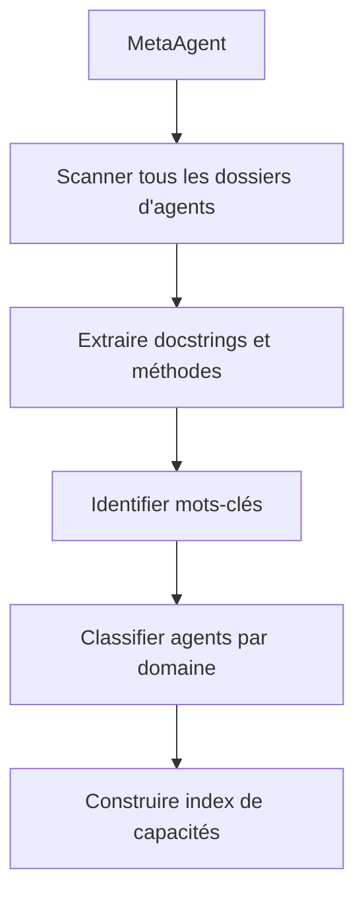
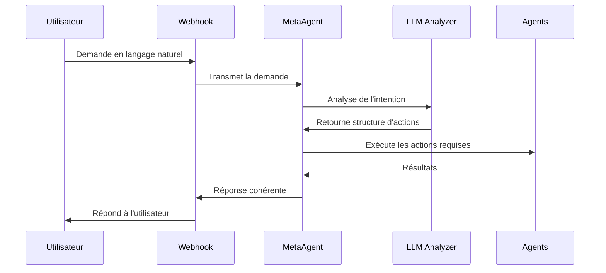

# Système d'Intelligence Conversationnelle BerinIA

## Vue d'ensemble

Le système d'intelligence conversationnelle de BerinIA est une couche centralisée qui permet aux utilisateurs d'interagir avec le système de manière naturelle, sans avoir à connaître les commandes spécifiques ou les noms exacts des agents. Ce document explique l'architecture, les fonctionnalités et les avantages de cette nouvelle approche.

## Problématique initiale

Le système initial présentait plusieurs limitations :

1. **Rigidité des mappings** : Les requêtes WhatsApp étaient redirigées vers des agents spécifiques selon un mapping rigide groupe → agent (ex: "📣 Annonces officielles" → "OverseerAgent")

2. **Absence de compréhension sémantique** : Le système ne pouvait pas comprendre des requêtes naturelles comme "compter les leads" s'il n'existait pas de mapping explicite pour cette action

3. **Dépendance aux structures exactes** : Les utilisateurs devaient formuler leurs demandes selon des formats précis pour que le système les comprenne

4. **Absence de découverte dynamique** : L'ajout de nouveaux agents nécessitait une mise à jour manuelle des mappings

## Solution implémentée : MetaAgent

Pour résoudre ces problèmes, nous avons développé le MetaAgent, un agent central d'intelligence conversationnelle qui :

1. **Indexe dynamiquement les capacités du système** : Le MetaAgent analyse tous les dossiers d'agents pour découvrir leurs fonctionnalités
   
2. **Comprend les intentions en langage naturel** : Utilise un LLM pour analyser les requêtes et déterminer les actions à effectuer
   
3. **Route intelligemment les demandes** : Identifie l'agent le plus approprié pour répondre à chaque demande
   
4. **Orchestre des workflows complexes** : Peut exécuter des séquences d'actions impliquant plusieurs agents

## Architecture technique

### 1. Système d'indexation des capacités

Au démarrage, le MetaAgent construit une représentation complète des capacités du système :



### 2. Traitement des requêtes

Quand un utilisateur envoie une requête (via WhatsApp ou autre interface) :



### 3. Structure du code

Le MetaAgent est composé de plusieurs composants clés :

- **Indexation des capacités** : `index_system_capabilities()`, `_extract_agent_capabilities()`
- **Analyse des requêtes** : `analyze_request()`, `_extract_json()`
- **Exécution des actions** : `execute_actions()`, `_normalize_agent_name()`
- **Génération de réponses** : `generate_coherent_response()`
- **Gestion du contexte** : `update_conversation_history()`, `get_conversation_context()`

## Exemples d'utilisation

### 1. Demande de statistiques

**Requête utilisateur** : "Montre-moi les performances récentes"

**Analyse MetaAgent** :
```json
{
  "intent": "get_statistics",
  "confidence": 0.92,
  "actions": [
    {
      "agent": "PivotStrategyAgent",
      "action": "get_latest_statistics",
      "parameters": {}
    }
  ]
}
```

### 2. Compter des leads

**Requête utilisateur** : "Combien de leads avons-nous actuellement?"

**Analyse MetaAgent** :
```json
{
  "intent": "count_leads",
  "confidence": 0.97,
  "actions": [
    {
      "agent": "ScraperAgent",
      "action": "count_leads",
      "parameters": {}
    }
  ]
}
```

### 3. Explication du système

**Requête utilisateur** : "Explique-moi comment fonctionne BerinIA"

**Analyse MetaAgent** :
```json
{
  "intent": "system_explanation",
  "confidence": 0.99,
  "actions": [],
  "response": "BerinIA est un système d'automatisation composé de plusieurs agents spécialisés..."
}
```

## Améliorations techniques apportées

### 1. Normalisation des noms d'agents

Le MetaAgent gère intelligemment les variations de casse dans les noms d'agents grâce à une fonction de normalisation :

```python
def _normalize_agent_name(self, agent_name: str) -> str:
    # Si le nom se termine par 'Agent'
    if agent_name.lower().endswith("agent"):
        base_name = agent_name[:-5]  # Retirer "Agent"
        normalized = base_name[0].upper() + base_name[1:].lower() + "Agent"
        return normalized
    else:
        # Normalisation standard
        return agent_name[0].upper() + agent_name[1:].lower()
```

### 2. Extraction robuste du JSON

Pour gérer les différentes manières dont le LLM peut renvoyer du JSON :

```python
def _extract_json(self, text: str) -> str:
    # Cas 1: Le texte entier est du JSON valide
    # Cas 2: JSON délimité par des blocs de code ```json ... ```
    # Cas 3: Extraction basée sur les accolades
    # ...
```

### 3. Gestion des erreurs et fallbacks

Le système implémente plusieurs niveaux de fallback pour garantir une réponse cohérente même en cas d'erreur :

```python
if not success_results and error_results:
    error_messages = [r.get("result", {}).get("message", "Erreur inconnue") for r in error_results]
    return {
        "status": "error",
        "message": f"Des erreurs sont survenues: {'; '.join(error_messages)}"
    }
```

## Intégration avec le système existant

Le MetaAgent s'intègre de manière transparente avec les composants existants :

1. **Modification du webhook WhatsApp** : Remplacement des mappings rigides par le MetaAgent
2. **Mise à jour de webhook_config.py** : Ajout du MetaAgent à la liste des agents initialisés
3. **Utilisation du registre global** : Normalisation des noms d'agents pour garantir la compatibilité

## Avantages et bénéfices

1. **Expérience utilisateur améliorée** :
   - Les utilisateurs peuvent formuler leurs demandes en langage naturel
   - Le système s'adapte à différentes formulations d'une même demande
   - Les réponses sont plus cohérentes et utiles

2. **Facilité de maintenance** :
   - Ajout de nouveaux agents sans modification du code existant
   - Découverte automatique des capacités
   - Logs détaillés pour le diagnostic

3. **Évolutivité** :
   - Architecture adaptée pour intégrer de nouvelles fonctionnalités
   - Possibilité d'ajouter des embeddings vectoriels pour améliorer la correspondance
   - Support pour des workflows plus complexes

## Recommandations pour l'avenir

1. **Intégration d'embeddings vectoriels** :
   - Améliorer la correspondance entre les requêtes et les capacités
   - Utiliser des embeddings pour identifier les agents pertinents

2. **Système d'apprentissage continu** :
   - Enregistrer les interactions réussies pour améliorer le système
   - Implémenter un mécanisme de feedback

3. **Extension des capacités multimodales** :
   - Support pour les requêtes avec images
   - Analyse visuelle intégrée au système conversationnel

## Conclusion

Le système d'intelligence conversationnelle avec MetaAgent transforme l'interaction avec BerinIA, la rendant plus naturelle et intuitive. Cette approche centrée sur la compréhension du langage naturel et la découverte dynamique des capacités ouvre la voie à un système beaucoup plus flexible et facile à utiliser, tout en facilitant son extension future.
