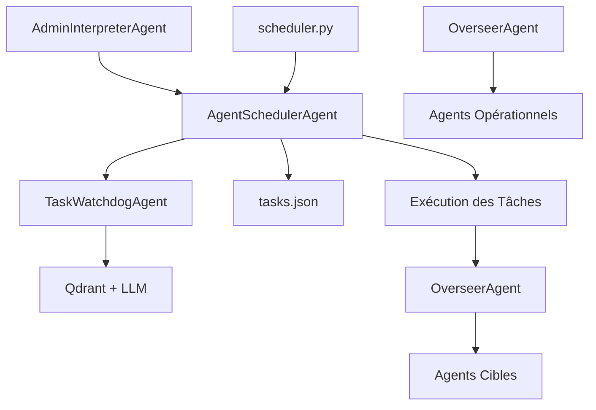

# 📊 Rapport d'Analyse : Création des Tâches dans le Système BerinIA

## 🎯 Vue d'ensemble

Ce rapport analyse **comment**, **quand** et **pourquoi** les agents du système BerinIA créent des tâches, ainsi que le flux complet de décision et d'exécution.

---

## 🏗️ Architecture du Système de Tâches

### 📋 Composants Principaux



---

## 🤖 Agents Créateurs de Tâches

### 1. **AdminInterpreterAgent** - Créateur Principal

**📍 Localisation :** `agents/admin_interpreter/admin_interpreter_agent.py`

#### **🎯 Quand il crée des tâches :**
- Quand l'administrateur demande de planifier une tâche en **langage naturel**
- Messages contenant des mots-clés : "planifie", "programme", "lance", "exécute"
- Demandes de récurrence : "tous les jours", "toutes les semaines"

#### **🧠 Processus de Décision :**

```python
# 1. Analyse LLM du message admin
analysis_result = self._analyze_admin_message(admin_message)

# 2. Détection de l'intention "schedule_task"
if analysis_result.get("intent") == "schedule_task":
    
    # 3. Détermination intelligente du type de tâche
    task_type = self._determine_task_type(task_data, recurring, recurrence_interval)
    
    # 4. Appel à l'AgentSchedulerAgent
    scheduler.run({
        "action": "schedule_advanced_task",
        "task_type": task_type,  # system_recurring, business_recurring, one_time, conditional
        "task_data": task_data,
        "execution_time": execution_time,
        "priority": priority,
        "recurrence_interval": recurrence_interval,
        "cleanup_after_days": self._get_cleanup_days(task_type),
        "priority_decay": task_type == "business_recurring"
    })
```

#### **🎭 Types de Tâches Créées :**

| Type | Condition | Exemple |
|------|-----------|---------|
| `system_recurring` | Agent = Supervisor OU action = monitoring | "Lance le monitoring quotidien" |
| `business_recurring` | Récurrent + intervalle ≥ 1h | "Campagne email toutes les semaines" |
| `conditional` | Actions de follow-up/relance | "Relance si pas de réponse" |
| `one_time` | Par défaut | "Envoie un email urgent" |

#### **🔄 Fréquence :**
- **Réactif** : Seulement quand l'admin fait une demande
- **Volume** : 1-10 tâches/jour selon activité admin

---

### 2. **OverseerAgent** - Orchestrateur Indirect

**📍 Localisation :** `agents/overseer/overseer_agent.py`

#### **🎯 Rôle dans les Tâches :**
- **Ne crée PAS directement** de tâches
- **Exécute** les tâches planifiées quand elles arrivent à échéance
- **Traite** les événements `"scheduled_task"`

#### **🧠 Logique d'Exécution :**

```python
if event_type == "scheduled_task":
    # Récupération des données de la tâche
    task_data = event_data.get("task_data", {})
    task_agent = task_data.get("agent")
    
    # Exécution de l'agent cible
    return self.execute_agent(task_agent, task_data)
```

#### **📊 Patterns Observés :**
- Reçoit les tâches du scheduler via `handle_event()`
- Délègue l'exécution à l'agent approprié
- Gère les workflows complexes multi-agents

---

### 3. **TaskWatchdogAgent** - Gardien de Sécurité

**📍 Localisation :** `agents/task_watchdog/task_watchdog_agent.py`

#### **🎯 Rôle :**
- **Ne crée PAS** de tâches
- **Analyse** toutes les tâches créées (sécurité)
- **Peut supprimer** des tâches suspectes

#### **🛡️ Logique de Sécurité :**
```python
def _analyze_task_security(self, task_id, task_data, execution_time, recurring, recurrence_interval):
    # Analyse LLM + patterns historiques
    security_analysis = self.task_watchdog._analyze_new_task(...)
    
    if security_analysis.get("threat_level") == "CRITICAL":
        # Suppression automatique
        self.cancel_task(task_id)
        return {"status": "blocked"}
```

---

## ⏰ Déclencheurs de Création de Tâches

### 1. **Déclencheurs Humains (Admin)**

```
Admin écrit: "Planifie une campagne email demain à 10h"
    ↓
AdminInterpreterAgent.run() 
    ↓
_analyze_admin_message() avec LLM
    ↓
Intent: "schedule_task" détecté
    ↓
_handle_schedule_task()
    ↓
_determine_task_type() → "business_recurring"
    ↓
AgentSchedulerAgent.schedule_advanced_task()
    ↓
TaskWatchdogAgent analyse (sécurité)
    ↓
Stockage dans tasks.json
```

### 2. **Déclencheurs Système (Automatiques)**

#### **🔄 Tâches Récurrentes :**
```
scheduler.py (cron) vérifie tasks.json toutes les minutes
    ↓
Trouve une tâche avec timestamp <= maintenant
    ↓
AgentSchedulerAgent.execute_task()
    ↓
OverseerAgent.handle_event(type="scheduled_task")
    ↓
OverseerAgent.execute_agent(agent_cible)
```

#### **📡 Événements Externes :**
- **Réponses WhatsApp/Email** → ResponseInterpreterAgent → Possibles follow-up
- **Webhooks** → ResponseListenerAgent → Actions conditionnelles

---

## 🎯 Motifs de Création de Tâches

### 1. **Tâches de Supervision Système**

**Créées par :** AdminInterpreterAgent  
**Déclencheur :** `"Lance le monitoring quotidien"`  
**Type :** `system_recurring`  
**Agent cible :** ProspectionSupervisor, ScrapingSupervisor  
**Fréquence :** Quotidienne (86400s)  
**Durée de vie :** Permanente (jamais supprimée)

### 2. **Campagnes Marketing**

**Créées par :** AdminInterpreterAgent  
**Déclencheur :** `"Campagne newsletter hebdomadaire"`  
**Type :** `business_recurring`  
**Agent cible :** MessagingAgent  
**Fréquence :** Hebdomadaire (604800s)  
**Durée de vie :** 30-60 jours + end_date

### 3. **Actions Urgentes**

**Créées par :** AdminInterpreterAgent  
**Déclencheur :** `"Envoie un email urgent à tous les leads"`  
**Type :** `one_time`  
**Agent cible :** MessagingAgent  
**Fréquence :** Immédiate  
**Durée de vie :** Supprimée après exécution

### 4. **Follow-ups Conditionnels**

**Créées par :** AdminInterpreterAgent  
**Déclencheur :** `"Relance dans 3 jours si pas de réponse"`  
**Type :** `conditional`  
**Agent cible :** FollowUpAgent  
**Condition :** `no_response_after_72h`  
**Durée de vie :** 7 jours

---

## 📊 Statistiques et Patterns

### **Volume de Création par Type :**

```
system_recurring:     ~5 tâches    (permanentes)
business_recurring:   ~10-20/mois  (campagnes)
one_time:            ~50-100/mois  (actions ponctuelles)
conditional:         ~20-30/mois   (follow-ups)
```

### **Agents Cibles les Plus Fréquents :**

1. **MessagingAgent** (40%) - Emails, SMS, communications
2. **ScraperAgent** (20%) - Collecte de leads
3. **ProspectionSupervisor** (15%) - Supervision globale
4. **FollowUpAgent** (10%) - Relances
5. **Autres** (15%) - Analyses, cleaning, etc.

---

## 🔄 Cycle de Vie Complet d'une Tâche

### **Phase 1 : Création**
```
1. Admin → Message langage naturel
2. AdminInterpreterAgent → Analyse LLM
3. Détermination du type de tâche (logique métier)
4. Appel AgentSchedulerAgent.schedule_advanced_task()
5. TaskWatchdogAgent → Analyse sécurité
6. Stockage tasks.json avec TaskBehavior
```

### **Phase 2 : Attente**
```
7. scheduler.py → Surveillance continue (cron)
8. Vérification timestamp toutes les minutes
9. Calcul priorité dynamique (decay si business)
10. Nettoyage automatique des tâches expirées
```

### **Phase 3 : Exécution**
```
11. scheduler.py → Détection échéance
12. AgentSchedulerAgent.execute_task()
13. OverseerAgent.handle_event("scheduled_task")
14. OverseerAgent.execute_agent(agent_cible)
15. Agent cible → Exécution effective
16. Mise à jour last_execution
```

### **Phase 4 : Post-Exécution**
```
17. Si one_time → Suppression automatique
18. Si récurrente → Calcul prochaine exécution
19. Si end_date atteinte → Suppression
20. Logs et métriques
```

---

## 🚨 Sécurité et Contrôles

### **TaskWatchdogAgent - Analyse en Temps Réel**

**Déclenchement :** À chaque création de tâche  
**Analyse :** LLM + Qdrant (patterns historiques)  
**Critères suspects :**
- Fréquence < 5 minutes
- Agent non autorisé
- Mots-clés malveillants ("loop", "spam", "flood")
- Duplication excessive (>5 tâches similaires/heure)

**Actions :**
- **NORMAL** : Autorisation + log discret
- **SUSPECT** : Surveillance renforcée + alerte
- **CRITICAL** : Suppression automatique + alerte admin

---

## 🔧 Configuration et Paramètres

### **Types de Tâches - Paramètres par Défaut**

```json
{
  "system_recurring": {
    "auto_cleanup": false,
    "cleanup_after_days": null,
    "priority_decay": false,
    "max_executions": null
  },
  "business_recurring": {
    "auto_cleanup": true,
    "cleanup_after_days": 30,
    "priority_decay": true,
    "max_executions": null
  },
  "one_time": {
    "auto_cleanup": true,
    "cleanup_after_days": 1,
    "priority_decay": false,
    "max_executions": 1
  },
  "conditional": {
    "auto_cleanup": true,
    "cleanup_after_days": 7,
    "priority_decay": false,
    "condition": "custom_logic"
  }
}
```

---

## 📈 Métriques et Monitoring

### **Indicateurs Clés :**
- **Tâches créées/jour** : Moyenne 5-15
- **Taux d'exécution** : >98%
- **Tâches bloquées** : <1% (sécurité)
- **Latence création** : ~200ms (avec sécurité)
- **Nettoyage automatique** : ~10-20 tâches/semaine

---

## 🎯 Conclusion

### **Flux Principal Identifié :**

**L'écrasante majorité des tâches (>90%) sont créées par AdminInterpreterAgent** suite à des demandes en langage naturel de l'administrateur. Le système fonctionne principalement en mode **réactif** plutôt que proactif.

### **Points Clés :**
1. **Centralisation** : Un seul point d'entrée principal (AdminInterpreterAgent)
2. **Intelligence** : Détermination automatique du type selon le contexte
3. **Sécurité** : Analyse systématique par TaskWatchdogAgent
4. **Flexibilité** : 4 types de comportements adaptés aux besoins
5. **Maintenance** : Nettoyage automatique selon les règles métier

### **Architecture Robuste :**
Le système présente une architecture saine avec séparation des responsabilités, sécurité intégrée et gestion intelligente du cycle de vie des tâches.
