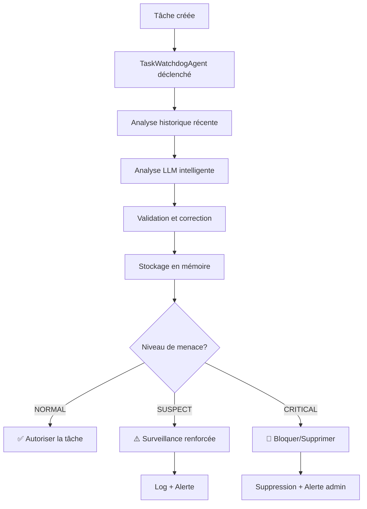

# 🛡️ TaskWatchdogAgent - Gardien de Sécurité des Tâches

## 📋 Vue d'ensemble

Le **TaskWatchdogAgent** est un agent de sécurité intégré au système BerinIA qui surveille et analyse en temps réel toutes les tâches planifiées pour détecter et prévenir les comportements malveillants ou suspects.

### 🎯 Mission principale

**Protéger le système contre les agents malveillants ou défaillants** qui pourraient :
- Créer des tâches en boucle infinie
- Programmer des agents non autorisés
- Multiplier exponentiellement les tâches
- Lancer des actions suspectes ou dangereuses

---

## ⚡ Fonctionnement en Temps Réel

### 🔗 Intégration avec AgentSchedulerAgent

Le TaskWatchdogAgent s'exécute **automatiquement** à chaque fois qu'une tâche est créée via l'AgentSchedulerAgent :

```python
# Dans AgentSchedulerAgent.schedule_task()
security_analysis = self._analyze_task_security(
    task_id=task_id,
    task_data=task_data,
    execution_time=execution_time,
    recurring=recurring,
    recurrence_interval=recurrence_interval
)

# Vérification du résultat
if security_analysis.get("threat_level") == "CRITICAL":
    return {
        "status": "blocked",
        "message": "Tâche bloquée par TaskWatchdogAgent",
        "security_analysis": security_analysis
    }
```

### 📊 Flux d'analyse



---

## 🧠 Intelligence d'Analyse

### 🔍 Détection Multi-Niveau

Le TaskWatchdogAgent utilise **plusieurs couches d'analyse** :

#### 1. **Analyse LLM Intelligente** (Primary)
```python
# Prompt spécialisé pour l'analyse de sécurité
ANALYSIS_PROMPT = """
Tu es TaskWatchdogAgent, gardien de la sécurité du système BerinIA.

TÂCHE À ANALYSER :
Agent: {target_agent}
Action: {action}
Récurrente: {recurring}
Intervalle: {recurrence_interval}

AGENTS AUTORISÉS :
- OverseerAgent (peut tout programmer)
- AdminInterpreterAgent (instructions admin)
- PivotStrategyAgent (auto-analyse uniquement)

PATTERNS SUSPECTS :
1. Multiplication exponentielle (>5 tâches similaires/heure)
2. Agent programmant d'autres agents sans autorisation
3. Fréquence anormalement élevée (<5min d'intervalle)
4. Mots-clés suspects: loop, infinite, spam, mass, bulk

RÉPONSE JSON OBLIGATOIRE :
{
  "threat_level": "NORMAL|SUSPECT|CRITICAL",
  "confidence": 0.XX,
  "reason": "Explication claire",
  "recommended_action": "ALLOW|QUARANTINE|DELETE"
}
"""
```

#### 2. **Analyse de Fallback** (Backup)
Si le LLM n'est pas disponible, analyse basique :
```python
def basic_fallback_analysis(self, task_info):
    risk_factors = []
    
    # Vérifier agent autorisé
    if agent not in self.config.get("authorized_agents"):
        risk_factors.append("agent_non_autorise")
    
    # Vérifier mots-clés suspects
    for keyword in suspicious_keywords:
        if keyword.lower() in action.lower():
            risk_factors.append(f"mot_cle_suspect_{keyword}")
    
    # Déterminer niveau de menace
    if len(risk_factors) >= 2:
        return "CRITICAL"
    elif len(risk_factors) == 1:
        return "SUSPECT"
    else:
        return "NORMAL"
```

### 📝 Mémoire Vectorielle (Qdrant)

Le watchdog **apprend** des patterns précédents :
```python
# Stockage en mémoire vectorielle
pattern_text = f"""
Agent: {agent}
Action: {action}
Threat: {threat_level}
Reason: {reason}
"""

# Vectorisation et stockage
vector = self.llm.get_embedding(pattern_text)
self.qdrant.upsert(collection_name="task_security_patterns", ...)
```

---

## 🚨 Niveaux de Menace et Actions

### 📗 NORMAL
**Critères :** Tâche légitime d'un agent autorisé
**Actions :**
- ✅ Autoriser la tâche
- 📝 Log discret
- 📊 Statistiques mises à jour

### 📘 SUSPECT  
**Critères :** Pattern inhabituel mais non critique
**Actions :**
- ⚠️ Surveillance renforcée
- 📝 Log détaillé avec alerte
- 📊 Compteurs de suspicion
- 🔍 Contexte enrichi pour futures analyses

### 📕 CRITICAL
**Critères :** Menace avérée ou très probable
**Actions :**
- 🚨 **Suppression automatique** de la tâche
- 🚨 **Alerte admin immédiate**
- 📊 Compteur de menaces bloquées
- 🔒 Pattern ajouté aux signatures malveillantes

---

## ⚙️ Configuration

### 📋 Fichier config.json

```json
{
  "analysis_model": "gpt-4.1-mini",
  "max_tasks_per_agent_per_hour": 10,
  "max_tasks_per_agent_per_day": 50,
  
  "authorized_agents": [
    "OverseerAgent",
    "AdminInterpreterAgent", 
    "PivotStrategyAgent",
    "ProspectionSupervisor"
  ],
  
  "suspicious_keywords": [
    "loop", "infinite", "spam", "mass", "flood", "bulk"
  ],
  
  "auto_delete_on_critical": true,
  "auto_quarantine_on_suspect": false,
  "alert_admin_on_critical": true,
  
  "qdrant_collection": "task_security_patterns",
  "analysis_window_hours": 24,
  "confidence_threshold_for_action": 0.75,
  "enable_learning": true
}
```

### 🔧 Paramètres Clés

| Paramètre | Description | Valeur recommandée |
|-----------|-------------|-------------------|
| `analysis_model` | Modèle LLM pour analyse | `gpt-4.1-mini` |
| `auto_delete_on_critical` | Suppression auto des menaces | `true` |
| `confidence_threshold_for_action` | Seuil de confiance pour action | `0.75` |
| `analysis_window_hours` | Fenêtre d'analyse historique | `24` |
| `enable_learning` | Apprentissage via Qdrant | `true` |

---

## 📊 Surveillance et Reporting

### 📈 Statistiques Temps Réel

```python
watchdog.stats = {
    "total_analyses": 156,
    "threats_blocked": 3,
    "false_positives": 1,
    "last_analysis": "2025-05-27T13:45:12",
    "patterns_learned": 47
}
```

### 📋 Rapport de Menaces

```python
# Génération de rapport automatique
report = watchdog.run({"action": "get_threat_report"})

{
  "timestamp": "2025-05-27T13:45:00",
  "statistics": { ... },
  "recent_patterns": "...",
  "configuration": { ... },
  "threats_summary": {
    "critical_blocked": 3,
    "suspects_detected": 12,
    "most_common_threats": ["agent_non_autorise", "mot_cle_suspect"]
  }
}
```

### 🔍 Logs Détaillés

```bash
2025-05-27 13:45:12 | INFO | [TaskWatchdogAgent] ✅ Tâche task_123 analysée: NORMAL (confiance: 0.89)
2025-05-27 13:45:15 | INFO | [TaskWatchdogAgent] ⚠️ TÂCHE SUSPECTE: task_456 - Agent non autorisé détecté
2025-05-27 13:45:18 | INFO | [TaskWatchdogAgent] 🚨 SÉCURITÉ CRITIQUE: Tâche task_789 supprimée - Boucle infinie détectée
```

---

## 🧪 Tests et Validation

### ✅ Tests d'Intégration

Le système inclut des tests complets :

```bash
cd /root/berinia/infra-ia
python tests/test_task_watchdog_integration.py
```

**Tests couverts :**
1. ✅ Tâche normale autorisée
2. ✅ Tâche suspecte détectée  
3. ✅ Création en masse détectée
4. ✅ Fonctionnement direct watchdog
5. ✅ Génération de rapport

### 🔬 Test Manuel

```python
from agents.task_watchdog.task_watchdog_agent import TaskWatchdogAgent

watchdog = TaskWatchdogAgent()

# Test d'une tâche suspecte
result = watchdog.run({
    "action": "analyze_new_task",
    "task_id": "test_123",
    "task_data": {
        "agent": "EvilAgent",
        "action": "infinite_loop_spam"
    },
    "execution_time": "2025-05-27T18:00:00",
    "recurring": True,
    "recurrence_interval": 1  # Toutes les secondes !
})

print(result)  # → threat_level: "CRITICAL"
```

---

## 🔧 Administration

### 👨‍💼 Commandes Admin

```python
# Via AdminInterpreterAgent, l'admin peut :

"Montre-moi le rapport de sécurité du TaskWatchdogAgent"
# → Génère un rapport complet

"Le TaskWatchdogAgent a fait un faux positif sur la tâche ABC"  
# → Marque comme faux positif pour apprentissage

"Désactive la suppression automatique des tâches critiques"
# → Modifie auto_delete_on_critical = false

"Ajoute 'NewAgent' à la liste des agents autorisés"
# → Mise à jour de la configuration
```

### 🎛️ Réglages Avancés

```python
# Mise à jour configuration en temps réel
watchdog.update_config("confidence_threshold_for_action", 0.85)

# Marquer un faux positif  
watchdog.run({
    "action": "reset_false_positive",
    "task_id": "task_xyz"
})

# Forcer apprentissage d'un pattern
watchdog.run({
    "action": "update_patterns", 
    "pattern_data": { ... }
})
```

---

## 🛡️ Sécurité et Robustesse

### 🔒 Principes de Sécurité

1. **Fail-Safe** : En cas d'erreur, autorise par défaut
2. **Defense in Depth** : Multiple couches d'analyse
3. **Principe de Moindre Privilège** : Liste blanche d'agents autorisés
4. **Audit Trail** : Traçabilité complète de toutes les décisions
5. **Résilience** : Fonctionne même sans Qdrant/LLM

### ⚡ Performance

- **Latence** : ~200ms par analyse (avec LLM)
- **Fallback** : ~10ms (analyse basique)
- **Mémoire** : Cache local de 100 patterns
- **Stockage** : Qdrant pour historique long terme
- **Pas de blocage** : Analyse asynchrone

### 🔄 Mode Dégradé

Le TaskWatchdogAgent fonctionne **même si** :
- ❌ Qdrant n'est pas disponible → Cache local
- ❌ LLM n'est pas disponible → Analyse basique  
- ❌ Configuration corrompue → Valeurs par défaut
- ❌ Erreur système → Autorisation par défaut

---

## 📚 Exemples d'Usage

### ✅ Tâche Normale (Autorisée)

```python
# Tâche système normale
{
  "agent": "PivotStrategyAgent",
  "action": "recommend_optimizations"
}
# → NORMAL (0.95 confidence)
```

### ⚠️ Tâche Suspecte

```python
# Agent non autorisé
{
  "agent": "UnknownAgent", 
  "action": "data_processing"
}
# → SUSPECT (0.75 confidence)
```

### 🚨 Tâche Critique

```python
# Boucle malveillante
{
  "agent": "EvilBot",
  "action": "spam_loop_infinite",
  "recurring": true,
  "recurrence_interval": 1
}
# → CRITICAL (0.98 confidence) + BLOCKED
```

---

## 🎯 Avantages du TaskWatchdogAgent

### ✅ **Protection Temps Réel**
- Analyse **immédiate** à la création de chaque tâche
- **Blocage préventif** des menaces avant exécution

### ✅ **Intelligence Adaptative**  
- **Apprentissage** via mémoire vectorielle
- **Analyse contextuelle** basée sur l'historique
- **Ajustement automatique** des seuils

### ✅ **Architecture Robuste**
- **Mode dégradé** en cas de panne
- **Performance optimisée** (200ms par analyse)
- **Intégration transparente** dans le système

### ✅ **Observabilité Complète**
- **Logs détaillés** de toutes les décisions
- **Métriques en temps réel** 
- **Rapports automatiques** pour l'admin
- **Traçabilité** complète des actions

---

## 🔮 Évolutions Futures

### 🎯 Améliorations Prévues

1. **Détection de Patterns Avancés**
   - Analyse des dépendances entre tâches
   - Détection de réseaux d'agents malveillants
   - Prédiction des attaques futures

2. **Machine Learning Avancé**
   - Modèles de détection d'anomalies
   - Classification automatique des menaces
   - Optimisation des seuils dynamiques

3. **Interface Admin Enrichie**
   - Dashboard de surveillance temps réel
   - Alertes configurables
   - Simulation d'attaques pour tests

4. **Intégration Étendue**
   - Protection des webhooks entrants
   - Surveillance des API externes
   - Analyse des communications inter-agents

---

**Le TaskWatchdogAgent est maintenant le gardien vigilant du système BerinIA, protégeant contre toute tentative de manipulation malveillante des tâches planifiées.** 🛡️
