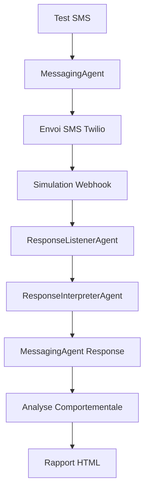

# 📱 Test SMS Comportemental Authentique - Documentation Technique

**Date de création :** 06/01/2025  
**Version :** 1.0  
**Auteur :** Système BerinIA  

## 🎯 Vue d'ensemble

Le **Test SMS Comportemental Authentique** est un outil de validation complète du système SMS de BerinIA. Il teste le flux complet de communication SMS en situation réelle avec des profils comportementaux d'entrepreneurs authentiques.

### 🚀 Objectifs principaux

1. **Validation du système SMS complet** - Test de bout-en-bout
2. **Test des directives SMS en BDD** - Utilisation des vraies configurations
3. **Simulation de comportements clients réels** - 6 profils comportementaux
4. **Génération de rapports détaillés** - Métriques spécialisées SMS
5. **Validation de la chaîne d'agents** - ResponseListener → ResponseInterpreter → MessagingAgent

## 🏗️ Architecture du Test

### Composants testés



### Flux de données authentique

1. **Génération leads comportementaux** → LeadGenerator
2. **Envoi SMS initial** → MessagingAgent (vraies directives BDD)
3. **Simulation réception SMS** → Webhook Twilio simulé
4. **Traitement réponse** → ResponseListenerAgent
5. **Interprétation** → ResponseInterpreterAgent
6. **Génération réponse** → MessagingAgent (LLM + directives)
7. **Analyse performance** → ResponseAnalyzer
8. **Génération rapport** → Rapport HTML avec métriques

## 📊 Profils Comportementaux

Le test utilise 6 profils comportementaux basés sur de vrais entrepreneurs :

| Profil | Description | Exemple SMS |
|--------|-------------|-------------|
| 😊 **Intéressé** | Curieux, pose questions pratiques | "Ça m'intéresse, dites-moi en plus" |
| 😰 **Hésitant** | Méfiant, déçu par le passé | "Je reste prudent après mes expériences" |
| 🤓 **Technique** | Veut détails précis, sécurité | "Quels sont les détails techniques ?" |
| ⚡ **Pressé** | Direct, pas de temps | "Soyez directe, j'ai pas le temps" |
| 😡 **Agressif** | Sceptique, exige des preuves | "Montrez-moi des preuves concrètes" |
| 📊 **Analytique** | Veut chiffres, ROI, données | "Quels sont les chiffres exactement ?" |

## 🔧 Métriques et Scoring

### Métriques SMS spécialisées
- **Longueur moyenne messages** (optimal < 160 chars)
- **Messages dépassant 160 chars** (violations format SMS)
- **Délai moyen de réponse** (simulation temps réel)
- **Taux de continuation conversation**

### Scores comportementaux (0-5)
- **Mémoire conversationnelle** - Louise se souvient-elle du contexte ?
- **Pertinence des réponses** - Réponses adaptées au profil client ?
- **Engagement client** - Qualité de l'interaction générée ?

### Grades finaux
- **A (4.5-5.0)** : Excellent - Prêt production
- **B (3.5-4.4)** : Très bien - Fonctionnel 
- **C (2.5-3.4)** : Correct - Améliorations possibles
- **D (1.5-2.4)** : À améliorer - Révision nécessaire
- **F (0-1.4)** : Problématique - Revoir directives

## 📄 Rapport HTML Généré

Le test produit un rapport HTML interactif comprenant :

### Section Synthèse
- Score global SMS avec grade coloré
- Métriques agrégées sur tous les profils
- Recommandations d'amélioration

### Section Conversations
- Conversations SMS complètes style mobile (bulles)
- Métriques par conversation
- Scores détaillés par profil
- Longueur des messages avec indicateurs

### Section Analyse
- Graphiques de performance (si disponibles)
- Recommandations spécifiques SMS
- Comparaison entre profils comportementaux

## 🚀 Utilisation

### Commandes de base

```bash
# Test complet (6 profils)
cd /root/berinia/infra-ia/tests
python test_sms_comportemental_authentique.py

# Test rapide (2 profils)
python test_sms_comportemental_authentique.py --quick

# Mode verbeux
python test_sms_comportemental_authentique.py --verbose
```

### Prérequis techniques

1. **Services actifs**
   - API Backend (port 8000) : `systemctl status berinia`
   - Directives SMS configurées en BDD

2. **Modules Python**
   - Framework de test comportemental existant
   - Agents BerinIA (MessagingAgent, ResponseListener, etc.)

3. **Configuration**
   - Directives SMS accessibles via `/api/messenger/directives`
   - Environnement Python activé si venv utilisé

## 🔍 Analyse des Résultats

### Indicateurs de succès

✅ **SMS Optimal** :
- Score global > 4.0
- Longueur moyenne < 120 chars
- 0 message > 160 chars
- Mémoire conversationnelle > 4.0

⚠️ **SMS À améliorer** :
- Score global 2.5-3.5
- Messages trop longs fréquents
- Réponses hors contexte
- Manque de personnalisation

❌ **SMS Problématique** :
- Score global < 2.5
- Erreurs système fréquentes
- Directives SMS mal configurées
- Réponses génériques

### Actions correctives

**Score faible** → Réviser directives SMS en BDD
**Messages trop longs** → Optimiser templates SMS
**Manque de mémoire** → Vérifier historique conversationnel
**Réponses génériques** → Améliorer prompts spécialisés SMS

## 🔄 Intégration Continue

### Tests automatisés recommandés

1. **Quotidien** : Test rapide (--quick) pour validation
2. **Hebdomadaire** : Test complet pour analyse approfondie
3. **Avant déploiement** : Test complet obligatoire
4. **Après modification directives** : Test immédiat

### Seuils d'alerte

- Score < 3.0 → Alerte équipe développement
- Messages > 160 chars > 20% → Révision urgente templates
- Erreurs système > 10% → Investigation technique

## 🛠️ Maintenance et Évolution

### Ajout de nouveaux profils

1. Modifier `agent_behavioral_testing/core/lead_generator.py`
2. Ajouter profil dans `generate_leads_for_test()`
3. Tester avec le nouveau profil

### Modification des métriques

1. Éditer `_calculate_sms_metrics()` dans le test
2. Mettre à jour `_generate_sms_html_content()` pour affichage
3. Documenter les nouvelles métriques

### Intégration de nouvelles technologies

Le test est conçu pour être extensible :
- Nouveaux canaux de communication
- Nouvelles métriques de performance  
- Nouveaux types d'analyse comportementale

## 📋 Troubleshooting

### Problèmes fréquents

**Import Error MessagingAgent**
```bash
# Vérifier les chemins Python
ls infra-ia/agents/messaging/messaging_agent.py
python -c "from agents.messaging.messaging_agent import MessagingAgent"
```

**Directives SMS vides**
```bash
# Vérifier l'API
curl http://localhost:8000/api/messenger/directives
# Configurer via dashboard si nécessaire
```

**Module core non trouvé**
```bash
# Vérifier modules comportementaux
ls infra-ia/tests/agent_behavioral_testing/core/
```

**Erreur LLM**
```bash
# Vérifier configuration LLM dans le système
# Vérifier les quotas API si applicable
```

## 📈 Métriques de Performance du Test

### Temps d'exécution typiques
- **Test rapide (2 profils)** : ~2-3 minutes
- **Test complet (6 profils)** : ~8-12 minutes  
- **Génération rapport HTML** : ~10-20 secondes

### Ressources utilisées
- **CPU** : Faible (principalement attente LLM)
- **Mémoire** : ~50-100 MB
- **Réseau** : Appels API LLM uniquement
- **Stockage** : Rapport HTML ~500KB-2MB

---

## 🎯 Conclusion

Le **Test SMS Comportemental Authentique** est un outil essentiel pour valider la qualité du système SMS BerinIA. Il garantit que :

1. ✅ Le système fonctionne en conditions réelles
2. ✅ Les directives SMS sont optimales
3. ✅ Les réponses sont adaptées aux profils clients
4. ✅ La performance respecte les standards SMS
5. ✅ L'évolution du système est mesurable

**Utilisation recommandée** : Test avant chaque déploiement production et monitoring régulier de la qualité des conversations SMS.
